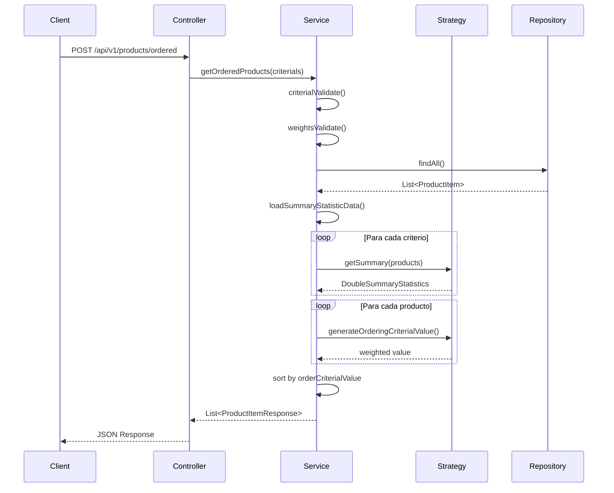

# Microservicio Catálogo de Productos

## Descripción

Microservicio desarrollado con **arquitectura hexagonal** que permite consultar y ordenar un catálogo de camisas basado en criterios ponderados. El sistema implementa el **patrón Strategy** para proporcionar flexibilidad en los criterios de ordenamiento y utiliza **normalización de datos** para ponderar correctamente los valores numéricos.

## Características Principales

- **Arquitectura Hexagonal**: Separación clara entre dominio, aplicación e infraestructura
- **Patrón Strategy**: Implementación flexible para criterios de ordenamiento
- **Normalización de Datos**: Los valores numéricos se normalizan para permitir ponderación efectiva
- **Criterios Configurables**: Fácil extensión con nuevos criterios de ordenamiento
- **Validación de Pesos**: Los pesos deben sumar 1 (con margen de error configurable)
- **API REST**: Endpoints documentados con OpenAPI/Swagger

## Arquitectura

### Componentes Principales

```
┌─────────────────┐    ┌─────────────────┐    ┌─────────────────┐
│CatalogController│    │ CatalogService  │    │ProductRepository│
│   (REST API)    │───▶│  (Use Cases)    │───▶│   (Data Access) │
└─────────────────┘    └─────────────────┘    └─────────────────┘
        │                 │           │                 │
        │                 ▼           ▼                 │
        │    ┌─────────────────┐  ┌─────────────────┐   │
        │    │   Strategy      │  │  SummaryStats   │   │
        │    │   Criterial     │  │  (Normalización)│   │
        │    └─────────────────┘  └─────────────────┘   │
        │                                               │
        │                                               │
        │                                               │
        └───────────────── Domain Model ─────────────────┘
```

### Normalización de Datos

El sistema normaliza los valores numéricos de los productos (ventas, stock ratio, etc.) para permitir una ponderación justa entre diferentes criterios:

1. **Cálculo de Estadísticas**: Se calculan min, max, promedio y desviación estándar
2. **Normalización**: Los valores se transforman a una escala común (0-1)
3. **Ponderación**: Se aplican los pesos especificados por el usuario
4. **Ordenamiento**: Los productos se ordenan por el valor ponderado total

## Requisitos

- **Java 17+**
- **Gradle 7+**
- **Spring Boot 3.x**

## Instalación y Ejecución

### 1. Clonar el Repositorio

```bash
git clone git@github.com:thesaintve/product_catalog.git
cd prueba-tecnica02
```

### 2. Ejecutar con Gradle

```bash
# Compilar el proyecto
./gradlew build

# Ejecutar la aplicación
./gradlew bootRun
```

### 3. Verificar el Estado

La aplicación estará disponible en: `http://localhost:8080`

Swagger UI: `http://localhost:8080/swagger-ui.html`

## API Endpoints

### 1. Obtener Productos Ordenados

**POST** `/api/v1/products/ordered`

Ordena los productos según criterios ponderados.

#### Ejemplo de Request:

```json
[
  {
    "criterial": "sales",
    "weight": 0.6
  },
  {
    "criterial": "stockRatio",
    "weight": 0.4
  }
]
```

#### Ejemplo de Response:

```json
[
  {
    "id": "1",
    "productName": "Camisa Blanca",
    "orderCriterialValue": 0.85
  },
  {
    "id": "2",
    "productName": "Camisa Azul",
    "orderCriterialValue": 0.72
  }
]
```

### 2. Obtener Todos los Productos

**GET** `/api/v1/products`

Retorna todos los productos sin ordenamiento específico.

## Ejemplos con cURL

### 1. Listar Todos los Productos

```bash
curl -X GET "http://localhost:8080/api/v1/products" \
  -H "Accept: application/json"
```

### 2. Obtener Productos Ordenados por Ventas (100%)

```bash
curl -X POST "http://localhost:8080/api/v1/products/ordered" \
  -H "Content-Type: application/json" \
  -H "Accept: application/json" \
  -d '[
    {
      "criterial": "sales",
      "weight": 1.0
    }
  ]'
```

### 3. Obtener Productos Ordenados por Criterios Múltiples

```bash
curl -X POST "http://localhost:8080/api/v1/products/ordered" \
  -H "Content-Type: application/json" \
  -H "Accept: application/json" \
  -d '[
    {
      "criterial": "sales",
      "weight": 0.7
    },
    {
      "criterial": "stockRatio",
      "weight": 0.3
    }
  ]'
```

### 4. Ejemplo con Tres Criterios
### Para poder correcr de forma efectiva este ejemplo se debe crear el criterio rating
```bash
curl -X POST "http://localhost:8080/api/v1/products/ordered" \
  -H "Content-Type: application/json" \
  -H "Accept: application/json" \
  -d '[
    {
      "criterial": "sales",
      "weight": 0.5
    },
    {
      "criterial": "stockRatio",
      "weight": 0.3
    },
    {
      "criterial": "rating",
      "weight": 0.2
    }
  ]'
```

## Configuración

### application.properties

```yaml
weights.error.margin=0.01  # Margen de error para la suma de pesos (1 ± 0.01)

logging.level.com.prueba.tecnica02=DEBUG
```

## Extensibilidad

### Agregar Nuevos Criterios

Para agregar un nuevo criterio de ordenamiento:

1. **Crear implementación de Criterial**:

Al implementar Criterial se coloca la lógica para generar valor ponderado de ordenamiento.

```java
@Component("newCriterial")
public class NewCriterialStrategy implements Criterial {
    @Override
    public double generateOrderingCriterialValue(ProductItem product, 
                                               double weight, 
                                               DoubleSummaryStatistics stats) {
        // Lógica de normalización y ponderación
        return normalizedValue * weight;
    }
}
```

2. **Crear implementación de SummaryStats**:

Tambien se debe implementar SummaryStats para definir de donde se obtiene los valores maximos y minimos utilizados en la normalización.
```java
@Component("newCriterialSummaryStats")
public class NewCriterialSummaryStats implements SummaryStats {
    @Override
    public DoubleSummaryStatistics getSummary(List<ProductItem> products) {
        // Cálculo de estadísticas para normalización
        return statistics;
    }
}
```

## Validaciones

- **Criterios Válidos**: Solo se aceptan criterios registrados en el sistema
- **Suma de Pesos**: Los pesos deben sumar 1.0 (± margen de error configurable)
- **Criterios Obligatorios**: Debe especificarse al menos un criterio

## Diagrama de Secuencia



## Testing

```bash
# Ejecutar tests unitarios
./gradlew test

```


